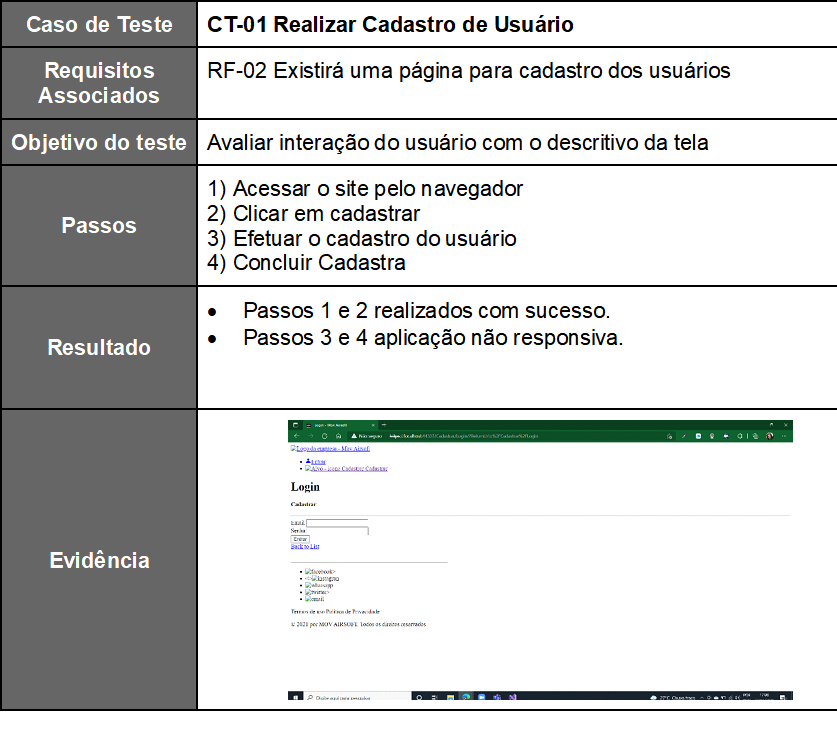

# Registro de Testes de Software

Os resultados obtidos nos testes de software realizados são descritos na Tabela a seguir.

●	Site publicado na Internet

●	Navegador da Internet – Chrome e Edge

Os testes funcionais a serem realizados no aplicativo são descritos a seguir.
 

